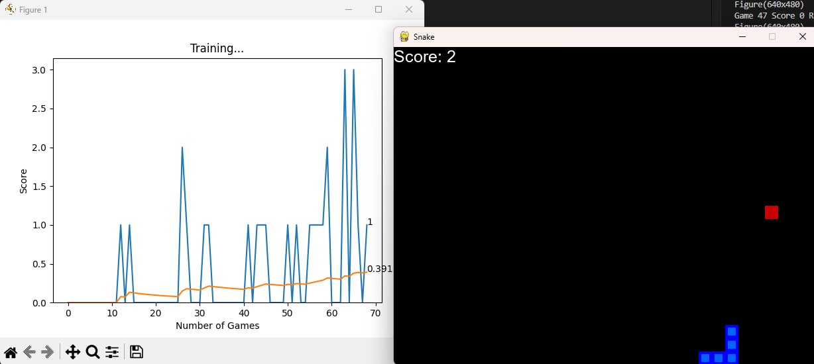

# Multi Agent Snake Game

Making computer agent learn snake game using Deep Qlearning Algorithm. 
Player/User can also compete against the computer agent (MultiAgent Game).




Run the code - 
1. Create and activate virtual environment
```
python -m venv env
.\env\Scripts\activate
```
2. Install required modules
```
pip install -r requirements.txt
``` 
3. Train the AI Agent
```
python train.py
```
4. Play against the AI Agent
```
python agent.py
```